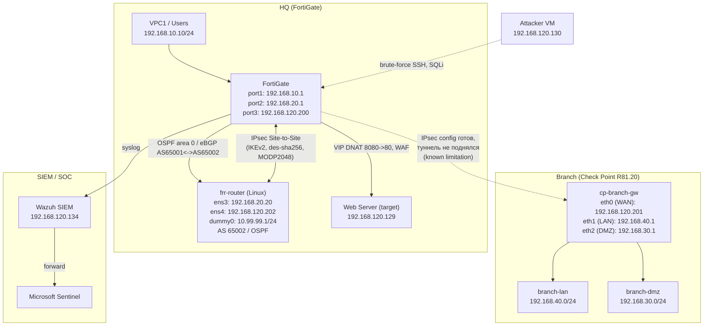
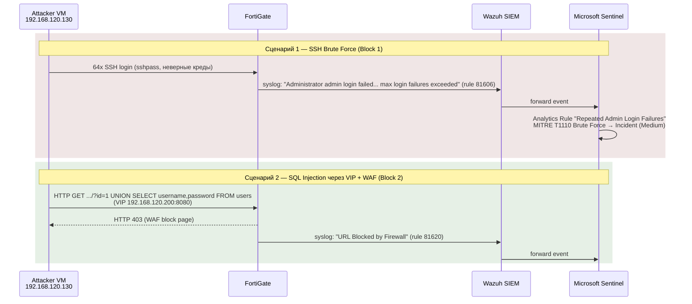

# FortiGate + Check Point Security Lab

Гибридная лаборатория сетевой безопасности (HQ ↔ Branch), развёрнутая в Eve-NG (192.168.120.135 / VMware NAT).
Демонстрирует навыки уровня Network Security Engineer / SOC Analyst (мидл+):
сегментация сети, динамическая маршрутизация, NGFW (FortiGate + Check Point), IPS/WAF,
Site-to-Site IPsec VPN, и SIEM-конвейер FortiGate → Wazuh → Microsoft Sentinel с обнаружением реальных атак.

> Связанные проекты:
> - [Linux Security Lab](https://github.com/deniskapolishuk2012/linux-security-lab)
> - [Azure Secure Foundation](https://github.com/deniskapolishuk2012/azure-secure-foundation)

---

## Архитектура

## Топология (таблица)

| Устройство | IP | Зона |
|------------|-----|------|
| FortiGate port1 | 192.168.10.1/24 | Users GW |
| FortiGate port2 | 192.168.20.1/24 | Servers GW / линк к frr-router |
| FortiGate port3 (WAN/mgmt) | 192.168.120.200/24 | VMware NAT |
| VPC1 (VPCS) | 192.168.10.10/24 | Users |
| frr-router ens3 | 192.168.20.20/24 | Linux BGP/OSPF router |
| frr-router ens4 | 192.168.120.202/24 | VPN endpoint (branch-side) |
| frr-router dummy0 | 10.99.99.1/24 | "Branch LAN" за VPN |
| Check Point cp-branch-gw eth0 (WAN) | 192.168.120.201/24 | VMware NAT (internet) |
| Check Point cp-branch-gw eth1 (LAN) | 192.168.40.1/24 | branch-lan сегмент |
| Check Point cp-branch-gw eth2 (DMZ) | 192.168.30.1/24 | branch-dmz сегмент |
| Wazuh SIEM | 192.168.120.134/24 | VMware NAT |
| Attacker VM | 192.168.120.130/24 | VMware NAT |

---

## Блок 1 — SIEM Pipeline: FortiGate → Wazuh → Microsoft Sentinel

**Цель:** базовая сегментация (Users ↔ Servers через FortiGate policy), сбор логов FortiGate в Wazuh
и пересылка в Microsoft Sentinel, обнаружение брутфорса SSH на основе MITRE ATT&CK.

- Базовая connectivity и firewall policy "Users-to-Servers" (port1 → port2)
- FortiGate логи поступают в Wazuh через decoder `fortigate-firewall-v5`
- Wazuh rule `81606` "Login failed" / `81619` "Multiple high traffic events"
- Атака: `sshpass` + bash-цикл → 64 неудачные попытки SSH с Attacker VM (192.168.120.130)
- Результат: Analytics Rule в Sentinel **"FortiGate - Repeated Admin Login Failures"**
  (Medium severity, MITRE T1110 Brute Force / Credential Access) → 15 инцидентов в Sentinel

**Грабли:** Hydra v9.6 несовместима с SSH FortiGate v8.0 → решение через `sshpass` + OpenSSH.

| Скриншот | Описание |
|---|---|
| [01](screenshots/block1/01-vpcs-ping-initial-connectivity.png) | Базовая связность VPC1 → Servers |
| [02](screenshots/block1/02-fortigate-policy-users-to-servers.png) | Firewall policy "Users-to-Servers" |
| [03](screenshots/block1/03-wazuh-fortigate-decoder-events.png) | Логи FortiGate в Wazuh (decoder fortigate-firewall-v5) |
| [04](screenshots/block1/04-fortigate-log-forwarding-setup.png) | Настройка пересылки логов FortiGate → Wazuh |
| [05](screenshots/block1/05-wazuh-fortigate-decoder-search.png) | Поиск событий по decoder в Wazuh |
| [06](screenshots/block1/06-wazuh-admin-logout-alert.png) | Алерт: Admin logout successful |
| [07](screenshots/block1/07-wazuh-high-traffic-alert.png) | Алерт: Multiple high traffic events |
| [08](screenshots/block1/08-wazuh-rule-81619-detail.png) | Детали правила 81619 (GDPR/HIPAA/PCI/NIST mapping) |
| [09](screenshots/block1/09-wazuh-rule-81606-login-failed-bruteforce.png) | Rule 81606 — брутфорс SSH с Attacker VM |
| [10](screenshots/block1/10-sentinel-incident-bruteforce.png) | Инцидент в Microsoft Sentinel (T1110 Brute Force) |

---

## Блок 2 — DNAT + WAF + детект SQL-инъекции

**Цель:** опубликовать внутренний веб-сервер через VIP (DNAT), включить Web Application Firewall
в режиме proxy, провести и обнаружить SQL-инъекцию.

- VIP **"VIP-WebServer-SQLi"**: `192.168.120.200:8080` → `192.168.120.129:80`
- Hairpin/intra-interface policy `port3 → port3`, inspection-mode **proxy**, `waf-profile default`
- Атака: `UNION SELECT username,password FROM users` через VIP
- Результат: HTTP 403 (WAF block page) → Wazuh rule `81620` "URL Blocked by Firewall" → видно в Sentinel

**Грабли:** WAF на FortiGate требует proxy inspection-mode (flow-based не подходит); порядок правил
UFW на бэкенде критичен; trial-лицензия ограничивает firewall policy до 3 (`vdom-max=3`).

| Скриншот | Описание |
|---|---|
| [01](screenshots/block2/01-wazuh-sqli-url-blocked.png) | Wazuh: "URL Blocked by Firewall", `UNION SELECT` в full_log |
| [02](screenshots/block2/02-fortigate-vip-waf-policy.png) | FortiGate: VIP + policy с WAF profile |
| [03](screenshots/block2/03-waf-block-page.png) | Страница блокировки WAF в браузере |

---

## Блок 3 — Динамическая маршрутизация: BGP + OSPF

**Цель:** связать FortiGate и Linux-маршрутизатор (frr/FRRouting) через OSPF area 0 и установить
eBGP-сессию между двумя автономными системами.

- **OSPF area 0**: FortiGate (192.168.20.1) ↔ frr-router (192.168.20.20) — Full/DR ↔ Full/Backup
- **eBGP**: AS 65001 (FortiGate) ↔ AS 65002 (frr-router) — маршрут `172.16.0.0/24` появился на FortiGate

**Грабли:**
- FortiGate OSPF `router-id` был `0.0.0.0` → "Process is not up" → исправлено `set router-id 192.168.20.1`
- FRR 8.x `bgp ebgp-requires-policy` блокирует обмен маршрутами без явных policy → `no bgp ebgp-requires-policy`

| Скриншот | Описание |
|---|---|
| [01](screenshots/block3/01-frr-ospf-neighbor.png) | frr-router: OSPF neighbor Full/Backup |
| [02](screenshots/block3/02-fortigate-ospf-interface-port2.png) | FortiGate: OSPF interface port2, State Backup |
| [03](screenshots/block3/03-fortigate-ospf-bgp-summary-routes.png) | FortiGate: OSPF neighbor Full/DR + BGP summary + полученный маршрут 172.16.0.0/24 |
| [04](screenshots/block3/04-frr-ospf-bgp-running-config.png) | frr-router: advertised-routes + running-config (router bgp 65002 / router ospf) |

---

## Блок 4 — Check Point R81.20 (Branch Firewall) + Site-to-Site VPN

### 4.1 Deploy + SmartConsole

- VM: QEMU `cpsg-r8120` в Eve-NG, Check Point R81.20 build 634, Open Server, режим Standalone
  (Security Gateway + Management), hostname `cp-branch-gw`
- Интерфейсы: eth0 → internet (External, WAN), eth1 → branch-lan (Internal, 192.168.40.0/24),
  eth2 → branch-dmz (Internal + DMZ, 192.168.30.0/24)
- SmartConsole: Topology настроена (External/Internal/DMZ), Anti-Spoofing Prevent/Log на всех интерфейсах

### 4.2–4.4 Object Management, Security Policy, NAT

- Network/Host objects, группы и сервисы под топологию HQ ↔ Branch
- Security Policy: Stealth rule, VPN traffic, Branch LAN out, DMZ Web, Cleanup,
  Application Control (блокировка P2P/torrent)
- NAT: Hide NAT для Branch-LAN, Static NAT для DMZ веб-сервера

### 4.7 Policy Install Workflow

- Verify → Install Policy → **Succeeded** на `cp-branch-gw`

| Скриншот | Описание |
|---|---|
| [01](screenshots/block4/01-checkpoint-network-objects.png) | SmartConsole: Network objects (hq-networks, branch-lan, branch-dmz, hq-servers, hq-users, fortigate-hq, wazuh-siem) |
| [02](screenshots/block4/02-checkpoint-policy-install-success.png) | SmartConsole: Install Policy — Succeeded |

### 4.5 Site-to-Site IPsec VPN

**Изначальный план:** IPsec Site-to-Site VPN FortiGate ↔ Check Point R81.20 (IKEv2, AES-256, SHA-256, VPN Community).

**Known limitation:** Phase1/Phase2/VPN Community/policy на Check Point настроены полностью, но туннель
не поднимается из-за низкоуровневого бага `iked`/CoreXL в виртуализации Eve-NG/QEMU
(`cpopen: cpdev is not initialized`, `vpnd_ioctl VPN_INIT_COMMUNITIES_LIST failed`, `NO_PROPOSAL_CHOSEN`
даже после отключения CoreXL через `cpconfig` и перезагрузки). Конфигурация задокументирована как
демонстрация компетенции по настройке Check Point VPN, при этом сама причина — инфраструктурный баг
виртуального окружения, а не ошибка конфигурации.

**Рабочая альтернатива:** Site-to-Site IPsec VPN **FortiGate ↔ frr-router (strongSwan)**, полностью поднят и проверен:

- frr-router получил второй интерфейс `ens4 = 192.168.120.202/24` (тот же сегмент, что FortiGate `port3 = 192.168.120.200`)
- `dummy0` на frr-router = `10.99.99.1/24` ("branch LAN")
- FortiGate `phase1-interface "ToLinuxBranch"` (port3, IKEv2, remote-gw 192.168.120.202)
  + `phase2-interface "ToLinuxBranch-P2"` (src `192.168.10.0/24` ↔ dst `10.99.99.0/24`)
- Туннель **ESTABLISHED**: `DES_CBC / HMAC_SHA2_256_128 / PRF_HMAC_SHA2_256 / MODP_2048`, CHILD_SA INSTALLED
- Подтверждено: `ping 192.168.10.10 → 10.99.99.1` проходит через туннель (TTL=63)

**Грабли:**
- Trial-лицензия FortiGate VM режет crypto-предложения до DES — `set proposal aes256-sha256` молча
  заменяется на `des-md5`/`des-sha1`. Рабочий proposal — `des-sha256` на обеих сторонах
  (strongSwan: `ike=des-sha256-modp2048!`, `esp=des-sha256-modp2048!`)
- Trial-лицензия также режет firewall policy (`vdom-max=3`) — новые policy создать нельзя,
  вместо этого интерфейс `ToLinuxBranch` добавлен в `srcintf`/`dstintf` существующей policy 3
- strongSwan `ipsec rereadall` не подхватывает изменения `ike=`/`esp=` для уже загруженного conn —
  требуется полный `ipsec restart`

| Скриншот | Описание |
|---|---|
| [03](screenshots/block4/03-strongswan-ipsec-statusall-established.png) | strongSwan `ipsec statusall` — ESTABLISHED, CHILD_SA INSTALLED |
| [04](screenshots/block4/04-strongswan-ipsec-conf.png) | `/etc/ipsec.conf` — конфигурация туннеля ToFortiGate |
| [05](screenshots/block4/05-fortigate-ipsec-phase1-phase2-routes.png) | FortiGate: phase1/phase2-interface, tunnel summary, routing table |
| [06](screenshots/block4/06-vpcs-ping-through-vpn-tunnel.png) | VPC1 → 10.99.99.1 через VPN-туннель (TTL=63) |

---

## Attack Pipeline

---

## Технологии

`FortiGate` `Check Point R81.20` `strongSwan` `IPsec/IKEv2` `BGP` `OSPF` `FRRouting` `WAF` `IPS`
`DNAT/VIP` `Wazuh` `Microsoft Sentinel` `MITRE ATT&CK` `Eve-NG`

## Фраза для собеседования

> Я построил гибридный Security Lab: FortiGate как HQ файервол с сегментацией, IPS, WAF, DNAT.
> Site-to-Site IPsec VPN с Linux/strongSwan-узлом (плюс полная конфигурация Check Point VPN —
> туннель не поднялся из-за бага виртуализации, задокументировано как known limitation).
> BGP/OSPF динамическая маршрутизация. Все события собираются в Wazuh и пересылаются в
> Microsoft Sentinel. Два сценария атак с полной цепочкой обнаружения (SSH brute-force, SQL injection).
