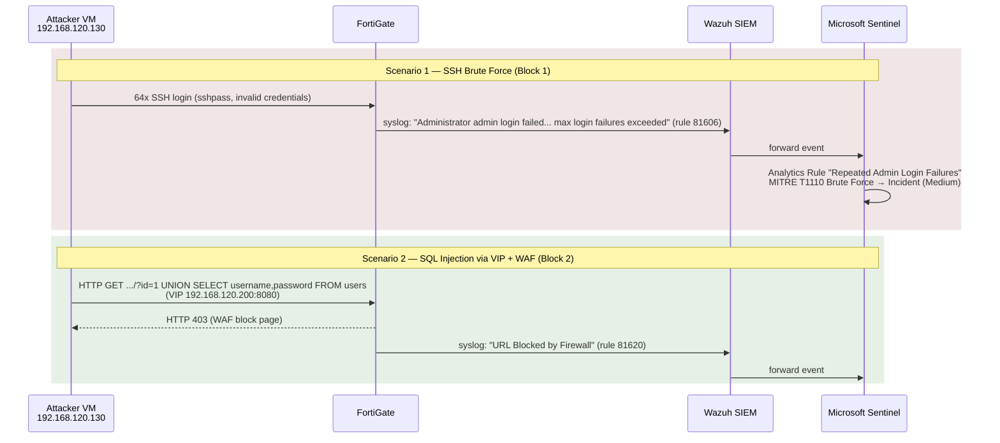

# FortiGate + Check Point Security Lab

A hybrid network security lab (HQ ↔ Branch) deployed in Eve-NG (192.168.120.135 / VMware NAT).
Demonstrates mid-level+ Network Security Engineer / SOC Analyst skills:
network segmentation, dynamic routing, NGFW (FortiGate + Check Point), IPS/WAF,
Site-to-Site IPsec VPN, and a SIEM pipeline FortiGate → Wazuh → Microsoft Sentinel
with detection of real attacks.

> Related projects:
> - [Linux Security Lab](https://github.com/deniskapolishuk2012/linux-security-lab)
> - [Azure Secure Foundation](https://github.com/deniskapolishuk2012/azure-secure-foundation)

---

## Architecture


## Topology

| Device | IP | Zone |
|------------|-----|------|
| FortiGate port1 | 192.168.10.1/24 | Users GW |
| FortiGate port2 | 192.168.20.1/24 | Servers GW / link to frr-router |
| FortiGate port3 (WAN/mgmt) | 192.168.120.200/24 | VMware NAT |
| VPC1 (VPCS) | 192.168.10.10/24 | Users |
| frr-router ens3 | 192.168.20.20/24 | Linux BGP/OSPF router |
| frr-router ens4 | 192.168.120.202/24 | VPN endpoint (branch side) |
| frr-router dummy0 | 10.99.99.1/24 | "Branch LAN" behind VPN |
| Check Point cp-branch-gw eth0 (WAN) | 192.168.120.201/24 | VMware NAT (internet) |
| Check Point cp-branch-gw eth1 (LAN) | 192.168.40.1/24 | branch-lan segment |
| Check Point cp-branch-gw eth2 (DMZ) | 192.168.30.1/24 | branch-dmz segment |
| Wazuh SIEM | 192.168.120.134/24 | VMware NAT |
| Attacker VM | 192.168.120.130/24 | VMware NAT |

---

## Block 1 — SIEM Pipeline: FortiGate → Wazuh → Microsoft Sentinel

**Goal:** basic segmentation (Users ↔ Servers via FortiGate policy), collect FortiGate logs in Wazuh
and forward them to Microsoft Sentinel, detect SSH brute-force based on MITRE ATT&CK.

- Basic connectivity and the "Users-to-Servers" firewall policy (port1 → port2)
- FortiGate logs are ingested into Wazuh via the `fortigate-firewall-v5` decoder
- Wazuh rules `81606` "Login failed" / `81619` "Multiple high traffic events"
- Attack: `sshpass` + bash loop → 64 failed SSH login attempts from the Attacker VM (192.168.120.130)
- Result: Sentinel Analytics Rule **"FortiGate - Repeated Admin Login Failures"**
  (Medium severity, MITRE T1110 Brute Force / Credential Access) → 15 incidents in Sentinel

**Gotcha:** Hydra v9.6 is incompatible with FortiGate v8.0 SSH → solved with `sshpass` + OpenSSH instead.

| Screenshot | Description |
|---|---|
| [01](screenshots/block1/01-vpcs-ping-initial-connectivity.png) | Basic connectivity VPC1 → Servers |
| [02](screenshots/block1/02-fortigate-policy-users-to-servers.png) | "Users-to-Servers" firewall policy |
| [03](screenshots/block1/03-wazuh-fortigate-decoder-events.png) | FortiGate logs in Wazuh (fortigate-firewall-v5 decoder) |
| [04](screenshots/block1/04-fortigate-log-forwarding-setup.png) | FortiGate → Wazuh log forwarding setup |
| [05](screenshots/block1/05-wazuh-fortigate-decoder-search.png) | Searching events by decoder in Wazuh |
| [06](screenshots/block1/06-wazuh-admin-logout-alert.png) | Alert: Admin logout successful |
| [07](screenshots/block1/07-wazuh-high-traffic-alert.png) | Alert: Multiple high traffic events |
| [08](screenshots/block1/08-wazuh-rule-81619-detail.png) | Rule 81619 details (GDPR/HIPAA/PCI/NIST mapping) |
| [09](screenshots/block1/09-wazuh-rule-81606-login-failed-bruteforce.png) | Rule 81606 — SSH brute-force from Attacker VM |
| [10](screenshots/block1/10-sentinel-incident-bruteforce.png) | Microsoft Sentinel incident (T1110 Brute Force) |

---

## Block 2 — DNAT + WAF + SQL Injection Detection

**Goal:** publish an internal web server via VIP (DNAT), enable the Web Application Firewall
in proxy mode, perform and detect a SQL injection.

- VIP **"VIP-WebServer-SQLi"**: `192.168.120.200:8080` → `192.168.120.129:80`
- Hairpin/intra-interface policy `port3 → port3`, **proxy** inspection mode, `waf-profile default`
- Attack: `UNION SELECT username,password FROM users` via the VIP
- Result: HTTP 403 (WAF block page) → Wazuh rule `81620` "URL Blocked by Firewall" → visible in Sentinel

**Gotcha:** WAF on FortiGate requires proxy inspection mode (flow-based won't work); UFW rule order
on the backend is critical; the trial license limits firewall policies to 3 (`vdom-max=3`).

| Screenshot | Description |
|---|---|
| [01](screenshots/block2/01-wazuh-sqli-url-blocked.png) | Wazuh: "URL Blocked by Firewall", `UNION SELECT` in full_log |
| [02](screenshots/block2/02-fortigate-vip-waf-policy.png) | FortiGate: VIP + policy with WAF profile |
| [03](screenshots/block2/03-waf-block-page.png) | WAF block page in browser |

---

## Block 3 — Dynamic Routing: BGP + OSPF

**Goal:** connect FortiGate and a Linux router (frr/FRRouting) via OSPF area 0 and establish
an eBGP session between two autonomous systems.

- **OSPF area 0**: FortiGate (192.168.20.1) ↔ frr-router (192.168.20.20) — Full/DR ↔ Full/Backup
- **eBGP**: AS 65001 (FortiGate) ↔ AS 65002 (frr-router) — route `172.16.0.0/24` appears on FortiGate

**Gotchas:**
- FortiGate OSPF `router-id` was `0.0.0.0` → "Process is not up" → fixed with `set router-id 192.168.20.1`
- FRR 8.x `bgp ebgp-requires-policy` blocks route exchange without explicit policies → `no bgp ebgp-requires-policy`

| Screenshot | Description |
|---|---|
| [01](screenshots/block3/01-frr-ospf-neighbor.png) | frr-router: OSPF neighbor Full/Backup |
| [02](screenshots/block3/02-fortigate-ospf-interface-port2.png) | FortiGate: OSPF interface port2, State Backup |
| [03](screenshots/block3/03-fortigate-ospf-bgp-summary-routes.png) | FortiGate: OSPF neighbor Full/DR + BGP summary + received route 172.16.0.0/24 |
| [04](screenshots/block3/04-frr-ospf-bgp-running-config.png) | frr-router: advertised-routes + running-config (router bgp 65002 / router ospf) |

---

## Block 4 — Check Point R81.20 (Branch Firewall) + Site-to-Site VPN

### 4.1 Deploy + SmartConsole

- VM: QEMU `cpsg-r8120` in Eve-NG, Check Point R81.20 build 634, Open Server, Standalone mode
  (Security Gateway + Management), hostname `cp-branch-gw`
- Interfaces: eth0 → internet (External, WAN), eth1 → branch-lan (Internal, 192.168.40.0/24),
  eth2 → branch-dmz (Internal + DMZ, 192.168.30.0/24)
- SmartConsole: Topology configured (External/Internal/DMZ), Anti-Spoofing Prevent/Log on all interfaces

### 4.2–4.4 Object Management, Security Policy, NAT

- Network/Host objects, groups and services matching the HQ ↔ Branch topology
- Security Policy: Stealth rule, VPN traffic, Branch LAN out, DMZ Web, Cleanup,
  Application Control (block P2P/torrent)
- NAT: Hide NAT for Branch-LAN, Static NAT for the DMZ web server

### 4.7 Policy Install Workflow

- Verify → Install Policy → **Succeeded** on `cp-branch-gw`

| Screenshot | Description |
|---|---|
| [01](screenshots/block4/01-checkpoint-network-objects.png) | SmartConsole: Network objects (hq-networks, branch-lan, branch-dmz, hq-servers, hq-users, fortigate-hq, wazuh-siem) |
| [02](screenshots/block4/02-checkpoint-policy-install-success.png) | SmartConsole: Install Policy — Succeeded |

### 4.5 Site-to-Site IPsec VPN

**Original plan:** IPsec Site-to-Site VPN FortiGate ↔ Check Point R81.20 (IKEv2, AES-256, SHA-256, VPN Community).

**Known limitation:** Phase1/Phase2/VPN Community/policy on Check Point are fully configured, but the tunnel
does not come up due to a low-level `iked`/CoreXL bug in the Eve-NG/QEMU virtualization
(`cpopen: cpdev is not initialized`, `vpnd_ioctl VPN_INIT_COMMUNITIES_LIST failed`, `NO_PROPOSAL_CHOSEN`
even after disabling CoreXL via `cpconfig` and rebooting). The configuration is documented as
proof of Check Point VPN configuration competency, while the root cause is an infrastructure bug
of the virtual environment, not a configuration error.

**Working alternative:** Site-to-Site IPsec VPN **FortiGate ↔ frr-router (strongSwan)**, fully established and verified:

- frr-router got a second interface `ens4 = 192.168.120.202/24` (same segment as FortiGate `port3 = 192.168.120.200`)
- `dummy0` on frr-router = `10.99.99.1/24` ("branch LAN")
- FortiGate `phase1-interface "ToLinuxBranch"` (port3, IKEv2, remote-gw 192.168.120.202)
  + `phase2-interface "ToLinuxBranch-P2"` (src `192.168.10.0/24` ↔ dst `10.99.99.0/24`)
- Tunnel **ESTABLISHED**: `DES_CBC / HMAC_SHA2_256_128 / PRF_HMAC_SHA2_256 / MODP_2048`, CHILD_SA INSTALLED
- Verified: `ping 192.168.10.10 → 10.99.99.1` traverses the tunnel (TTL=63)

**Gotchas:**
- The FortiGate VM trial license downgrades crypto proposals to DES — `set proposal aes256-sha256` is silently
  replaced with `des-md5`/`des-sha1`. The working proposal is `des-sha256` on both sides
  (strongSwan: `ike=des-sha256-modp2048!`, `esp=des-sha256-modp2048!`)
- The trial license also limits firewall policies (`vdom-max=3`) — new policies cannot be created,
  so the `ToLinuxBranch` interface was added to the `srcintf`/`dstintf` of the existing policy 3 instead
- strongSwan `ipsec rereadall` does not pick up `ike=`/`esp=` changes for an already-loaded conn —
  a full `ipsec restart` is required

| Screenshot | Description |
|---|---|
| [03](screenshots/block4/03-strongswan-ipsec-statusall-established.png) | strongSwan `ipsec statusall` — ESTABLISHED, CHILD_SA INSTALLED |
| [04](screenshots/block4/04-strongswan-ipsec-conf.png) | `/etc/ipsec.conf` — ToFortiGate tunnel configuration |
| [05](screenshots/block4/05-fortigate-ipsec-phase1-phase2-routes.png) | FortiGate: phase1/phase2-interface, tunnel summary, routing table |
| [06](screenshots/block4/06-vpcs-ping-through-vpn-tunnel.png) | VPC1 → 10.99.99.1 through the VPN tunnel (TTL=63) |

---

## Block 6 — Automation: FortiGate REST API

**Goal:** a reusable Python client for the FortiOS v2 REST API that any future automation
script can build on - e.g. a SOAR playbook or Wazuh active-response hook banning an
attacker IP with one call, instead of clicking through the GUI.

- `automation/fortigate/fortigate_api.py` — small reusable client for the FortiOS v2 REST API
  (token auth, system status, config backup, firewall address objects, address groups)
- Plug in your FortiGate's host/token via `config.json` and write any script on top of it:
  ```python
  from fortigate_api import FortiGateAPI
  fg = FortiGateAPI(host="192.168.120.200", token="...")
  fg.create_address("blocked-192.168.120.130", "192.168.120.130", comment="SSH brute-force source")
  fg.add_to_addrgrp("Blocked-IPs", "blocked-192.168.120.130")
  ```
- `automation/fortigate/backup_config.py` — snapshots the full running config to
  `backups/fortigate-<timestamp>.conf` before trying out policy/VLAN/routing changes,
  so a broken experiment can be restored
- Setup (API admin/token creation) — see [automation/fortigate/README.md](automation/fortigate/README.md)

---

## Attack Pipeline



---

## Technologies

`FortiGate` `Check Point R81.20` `strongSwan` `IPsec/IKEv2` `BGP` `OSPF` `FRRouting` `WAF` `IPS`
`DNAT/VIP` `Wazuh` `Microsoft Sentinel` `MITRE ATT&CK` `Eve-NG` `Python` `REST API`

## Interview pitch

> I built a hybrid security lab: FortiGate as the HQ firewall with segmentation, IPS, WAF, and DNAT.
> A Site-to-Site IPsec VPN to a Linux/strongSwan node (plus a complete Check Point VPN configuration —
> the tunnel didn't come up due to a virtualization bug, documented as a known limitation).
> BGP/OSPF dynamic routing. All events are collected in Wazuh and forwarded to
> Microsoft Sentinel. Two attack scenarios with full detection chains (SSH brute-force, SQL injection).
